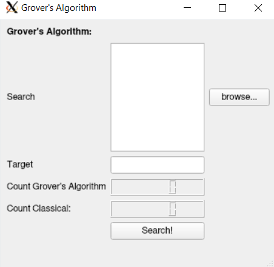
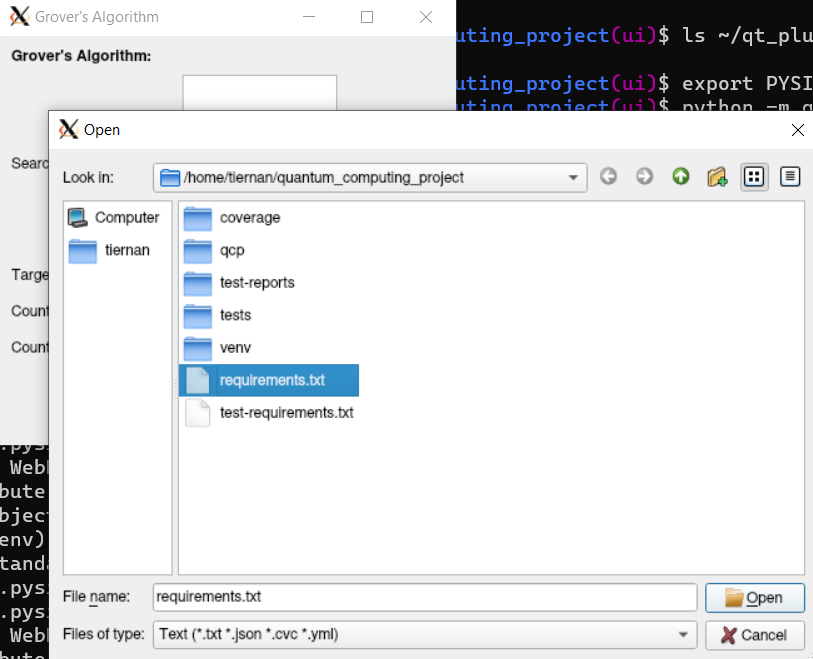
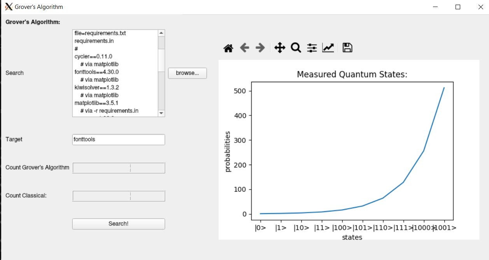

# Quantum Computing Project:

An implementation of a quantum computer simulator in Python to simulate the 
running of [Grover's Algorithm](https://qiskit.org/textbook/ch-algorithms/grover.html).

## Table of Contents:

* [Setup](#setup)
    * [Clone the Repository](#clone-the-repository)
    * [Optional - Run Tests](#optional---run-tests)
* [CLI](#cli-usage)
* [GUI](#gui)
    * [Search Input](#search-input)
    * [Target](#target)
    * [Search Button](#search-button)

## Setup:

To get started with the repository, you need to do the following:

### Clone the Repository:
Clone the repository to your system:
```console
$ git clone https://github.com/Tiernan8r/quantum_computing_project
```

Move into the cloned repository:
```console
$ cd quantum_computing_project
```

Setup a python virtual environment:
```console
$ python -m virtualenv venv
```

Activate the new virtualenvironment
```console
$ source venv/bin/activate
```

Download the PyPi program requirements:
```console
$ pip install -r requirements.txt
```

---
#### Optional - Run Tests:
Verify that all the tests are working, by running:
```console
$ pip install -r test-requirements.txt
```
```console
$ tox
```
There are three test actions configured for the repository, `tests`/`pep8`/
`mypy`.
The individual actions can be run using
```console
$ tox -e [action]
```
where `[action]` is one of `tests`/`pep8`/`mypy`

---
Once you have the repository set up on your system, you can run the code using
one of the following:

* [CLI Usage](#cli-usage)
* [GUI](#gui)
## CLI Usage:

The Help message for the CLI gives an overview of the program usage

```console
$ python -m qcp.main --help
USAGE:
/home/tiernan/quantum_computing_project/qcp/main.py [FLAGS] nqbits

ARGS:
    nqbits          The number of qbit states to simulate
FLAGS:
    -t/--target     The target state, defaults to 5
    -h/--help       Display this prompt
```

`nqbits`: is a required parameter, and controls the number of qbibts to simulate in the simulator
> **Note:**
> The quantum simulator simulates matrices of size `2^nqbits`, so be aware that
> The simulation takes exponentially longer for each extra qbit simulated.

`-t`/`--target`: is the target state to search for, must be bounded within `1 < t < 2^nqbits`
## GUI:

A User Interface is provided with the program to make interaction with it
easier.

The GUI can be initialised with the following command:
```console
$ python -m qcp.ui.main
```

This will bring up the following interface



### Search Input:
The "Search" box can either be populated manually, or alternatively the
"browse" dialog can be used to read the contents of a file of `.txt`/`.csv`/
`.json`/`.yaml`



### Target:

The "Target" text box must be populated manually with the value that we want to
search for.

### Search Button:

Once ready to search, hit the "Search!" button, and the program will simulate a
search of the input data using the Grover's Algorithm quantum algorithm.

Once the search is completed, a plot of the probability of the quantum state 
being in the target state will be shown on the right.

